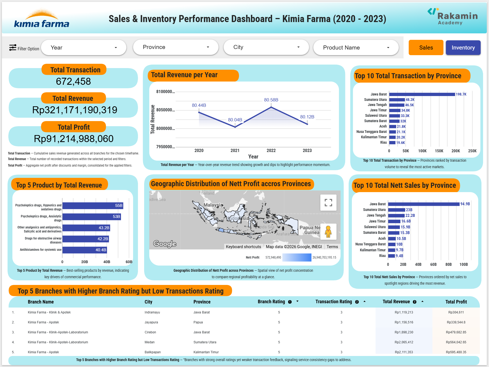
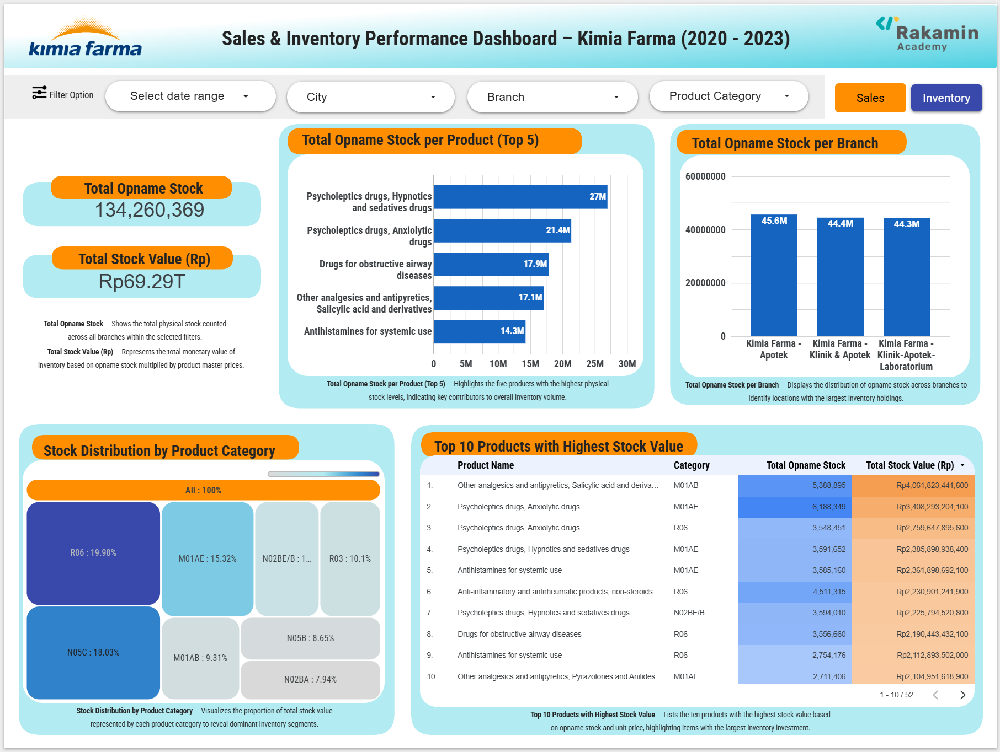

# BDA_KF_Rakamin — Sales & Inventory Performance Analysis (Kimia Farma 2020–2023)

## 1) Project Overview
This project delivers a unified analytical view of **sales, profitability, and inventory** for Kimia Farma across **2020–2023**. The solution integrates raw tables into a curated dataset and publishes **interactive dashboards** to explore trends, product/branch performance, stock value, and action points for business improvement.

## 2) Objectives & Business Questions
**Objectives**
- Build a **single source of truth** for sales & inventory analytics.
- Surface **trends, anomalies, and opportunities** to improve revenue, margin, and stock efficiency.

**Key Questions**
- What are the **year‑over‑year revenue** trends (2020–2023)?
- Which **products/categories** drive the most revenue and profit?
- Which **provinces/branches** outperform or lag?
- How healthy is **inventory** (physical stock, stock value, distribution, potential over/under‑stock)?

## 3) Data Sources
- `kf_final_transaction` — transactions (price, discount, customer, date).
- `kf_product` — product master (name, category, master price).
- `kf_kantor_cabang` — branches (name, city, province, branch rating).
- `kf_inventory` — inventory (opname/physical stock by branch–product).

## 4) Architecture & Tech Stack
- **Data Platform**: Google BigQuery  
- **Transformations**: StandardSQL (CTAS / `CREATE OR REPLACE TABLE`)  
- **BI / Visualization**: Looker Studio  
- **Support Tools**: SQL, (optional) Python for validation/EDA

## 5) Data Modeling & Core Transformations
**Step 1 — Integrated Analysis Table: `kf_analysis`**
- Join **transactions ↔ branches ↔ products**.
- Standardize data types; handle `NULL` discount → 0.
- Compute **nett_sales** = `price × (1 − discount)` and **nett_profit** using **tiered gross margin** by price bands.
- Include **transaction‑level rating** (`rating_transaksi`) for service quality assessment.

**Step 2 — Inventory Enrichment**
- Join `kf_analysis` ↔ `kf_inventory` on **two keys** (`branch_id`, `product_id`) to map the correct branch–product stock.
- Use **master product price** for consistent asset valuation (not transactional price).
- Compute **stock_value** = `opname_stock × product_master_price`.

> SQL scripts are placed under `/sql` (e.g., `01_kf_analysis.sql`, `02_kf_enrichment_inventory.sql`).

## 6) KPIs & Metrics
- **Total Transaction**  
- **Total Revenue** (+ Year‑over‑Year trend)  
- **Nett Profit**  
- **Top 5 Product by Total Revenue**  
- **Top 10 (Transaction / Nett Sales) by Province**  
- **Total Opname Stock** & **Total Stock Value (IDR)**  
- **Stock Distribution by Product Category**  
- **Top Products/Branches by Stock Value / Opname**

## 7) Dashboard Features
**Global Filters**: Year, Province, City, Branch, Product/Category, Mode (Sales/Inventory)

**Sales Page (preview above)**
- KPI cards (Total Transaction, Total Revenue, Total Profit)
- **Revenue per Year**
- **Top 10 Total Transaction by Province**
- **Top 10 Total Nett Sales by Province**
- **Top 5 Product by Total Revenue**
- **Geographic Distribution of Nett Profit**
- **Top 5 Branches with High Branch Rating but Low Transaction Rating**

**Inventory Page (preview above)**
- **Total Opname Stock** & **Total Stock Value (IDR)**
- **Top 5 Opname Stock by Product**
- **Top Opname Stock by Branch**
- **Stock Distribution by Product Category** (treemap)
- **Top 10 Products with Highest Stock Value**

## 8) Key Insights (At a Glance)
- **Revenue stability** around ~IDR 80B per year with low volatility in 2020–2023.  
- **Core CNS lines (psycholeptics: hypnotics/sedatives, anxiolytics)** dominate the Top‑5 revenue set → strong commercial drivers.  
- **Respiratory & antihistamines** show likely **seasonality**; aligning stock pre‑season can capture peaks.  
- **Stock value concentration** in a handful of categories → opportunity to optimize rotation and working capital.

## 9) Recommendations (Actionable)
- Classify core drivers as **A‑class (ABC)** to prioritize replenishment and service levels.  
- **Harmonize pricing/discounts** across CNS lines to avoid cannibalization and protect margins.  
- **Pre‑season inventory planning** for respiratory & antihistamines by province/city pattern.  
- Deploy **demand forecasting + safety stock** at branch–product level to reduce stockouts/overstock.  
- Curate portfolio: push **high‑velocity SKUs**; review slow, low‑margin long‑tail.

## 10) How to Reproduce
1. **GCP Setup**: Create project `KimiaFarma-BDA` and dataset `kimia_farma`.  
2. **Load Source Tables**: Import `kf_final_transaction`, `kf_product`, `kf_kantor_cabang`, `kf_inventory` (CSV/Parquet).  
3. **Run SQL**: Execute transformation scripts (Step 1 & 2) in BigQuery to build `kf_analysis` and the enriched table.  
4. **Connect Looker Studio**: Point to the curated tables; add filter controls and configure visuals.  
5. **Refine Visuals**: Style KPIs, charts, and filters consistently; validate numbers vs. source.

## 11) Repository Structure
.
├── assets/
│   ├── Sales_Dashboard_preview.png
│   └── Inventory_Dashboard_preview.png
├── sql/
│   ├── 01_kf_analysis.sql
│   └── 02_kf_analysis_with_inventory.sql
└── README.md

## 12) Limitations & Notes
- Schema types may vary by source; **autodetect** can mis‑type fields → prefer **explicit schemas** for production.  
- Margin calculation uses **tiered price‑based logic**; if **COGS** is available, replace with actual gross margin.  
- Seasonality and market effects should be validated against contextual factors (policy, promotions, distribution constraints).

## 13) License & Contact
- **License**: MIT (or your preferred license)  
- **Contact**: (Kuntur Jalassuad/ jalassuad.k@gmail.com / [LinkedIn](https://www.linkedin.com/in/kuntur-jalassuad/))
